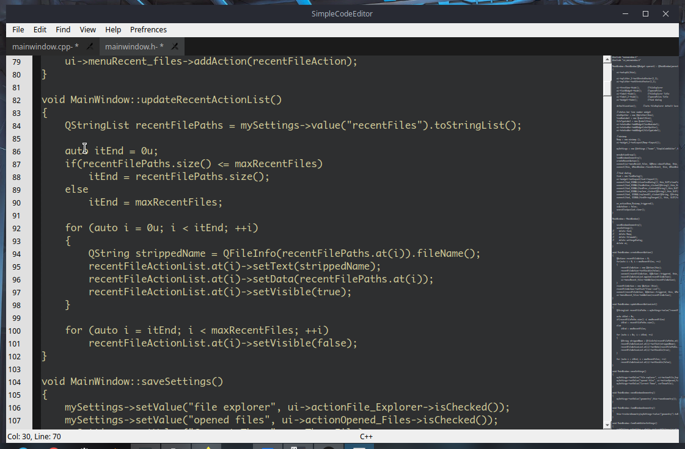

SimpleCodeEditor

Written in C++ and QT

**Features**:
    <ol>
        <li>Syntax Highlighting</li>
        <li>Tabbed Text editor</li>
        <li>Terminal</li>
        <li>And More Features to come</li>
    </ol>

**Install**:

**Binary**
Download from [Releases](https://github.com/kum8r/SimpleCodeEditor/releases)

**Build From Source**
install [Qt](https://qt.io "Qt") , [qscintilla](https://www.riverbankcomputing.com "qscintilla") and [qtermwidget](https://github.com/lxqt/qtermwidget)

- git clone https://github.com/kum8r/SimpleCodeEditor.git
- cd SimlpeCodeEditor
- mkdir build && cd build
- qmake ..
- make
- ./SimpleCodeEditor

<b>Screenshot</b>

    

[qt]: http://qt.io
