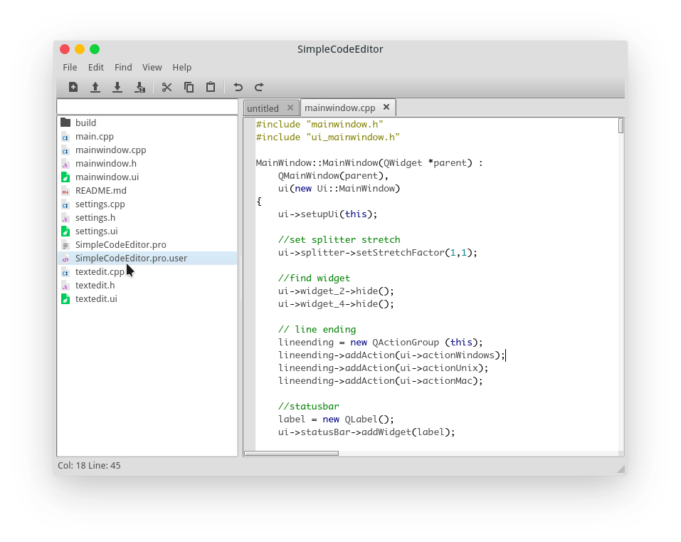

SimpleCodeEditor

Written in C++ and QT

Features:
	<ol>
		<li>Syntax Highlighting</li>
		<li>Tabbed Text editor</li>
		<li>And More Features to come</li>
	</ol>

Install:

		
 install <a href="https://qt.io/"> Qt </a> <a href="https://www.riverbankcomputing.com"> qscintilla </a> 

	<ol>
		<li>cd SimpleCodeEditor </li>
		<li>mkdir build && cd build </li>
		<li> qmake .. </li>
		<li>make </li>
		<li>./SimpleCodeEditor </li>
	
<b>Screenshot</b>

	

